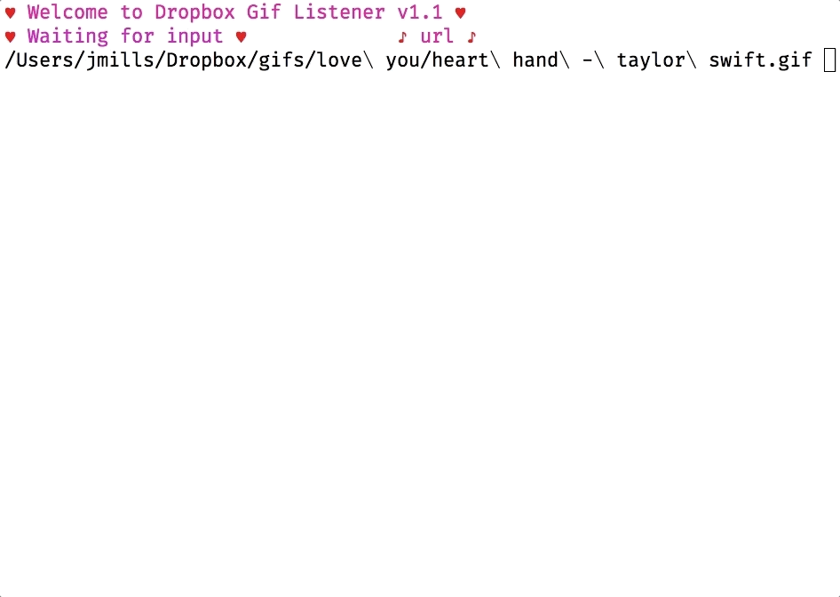

# Dropbox Gif Linker

Designed to make working with your Dropbox gifs easier when wanting to share them.

## Dropbox Integration

First, you need to create a new [Dropbox app][dropbox-new-app], using the **Dropbox API** (not the 
business option), with **Full Dropbox** access. Once you have that setup, you will need to click 
the _Generate_ button beneath the **Generate Access Token** header of the **OAuth2** section. This 
is the token that will be used for interacting with your Dropbox account.

## Configuration

In your home directory, make sure to create `.dgl.json` file, and fill in the details:

```json
{
	"dropbox_path" : "~/Dropbox",
	"dropbox_gif_dir" : "gifs/",
	"dropbox_api_token" : "YOUR_API_TOKEN"
}
```

⚠️ The program will not load if you do not have this file setup correctly. All details are required.

## Usage

Download the respective binary for your system, open a terminal, and execute it.

Then use a file manager to drag-and-drop a gif from your designated DropBox folder onto it, and press enter.

If everthing goes well, you'll have a handy-dandy, publicly-shareable URL on your clipboard.

Prefer some markdown? Just type in `md` and press enter. To get back, just type in `url`.

Done with it? `exit` and `quit` are your friends 💖

Other useful commands:

- `config`
- `count`
- `version`


Lost? Need help? Try `help`!

### `dropbox-gif-linker`

Need the current version?

```
$ dropbox-gif-linker version
dropbox-gif-linker version 0.80 darwin/amd64
```

Would you prefer to start in `markdown` mode?

```
$ dropbox-gif-linker md
```

Need to force it to start in `url` mode?

```
$ dropbox-gif-linker url
```




[dropbox-new-app]: https://www.dropbox.com/developers/apps
